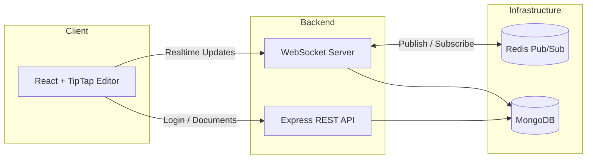
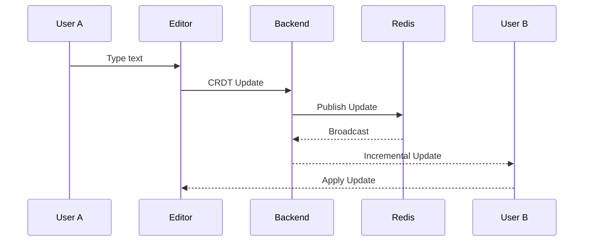
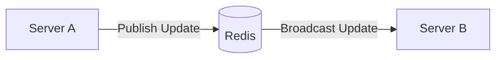

# Collaborative Document Editor

A real-time collaborative document editor inspired by applications like Google Docs, built to explore distributed systems, real-time synchronization, and scalable backend architecture.

The project focuses on a core engineering challenge:

> **How can multiple users edit the same document simultaneously without overwriting each other's work?**

To solve this, the editor combines **WebSockets**, **Yjs (CRDTs)**, **Redis Pub/Sub**, and **MongoDB** to synchronize document updates across multiple users and backend instances.

Unlike a traditional CRUD application, only incremental document updates are exchanged, allowing users to collaborate in real time while keeping network traffic low.

---

## Highlights

- Real-time collaborative editing
- CRDT-based conflict resolution using Yjs
- Live cursor and user presence
- JWT authentication
- Redis Pub/Sub for multi-server synchronization
- MongoDB persistence
- Docker support

---

# Why This Project?

Most web applications follow a request-response model:

```
Client → Server → Response
```

Collaborative editors work differently.

Every keystroke made by one user should appear on every other user's screen almost instantly.

As more users join, the application must continue synchronizing changes without introducing conflicts or requiring users to manually merge edits.

Building this project helped me explore:

- Event-driven communication using WebSockets
- Conflict-free synchronization using CRDTs
- Distributed messaging with Redis Pub/Sub
- Stateless backend architecture
- Designing systems that scale beyond a single server

The objective wasn't to recreate Google Docs, but to understand the architectural decisions behind collaborative software.

---

# Features

## Real-Time Collaboration

- Simultaneous document editing
- Automatic synchronization between users
- Incremental document updates
- Live cursor awareness

## Authentication

- User registration and login
- JWT-based authentication
- Password hashing with bcrypt
- Protected API routes

## Distributed Synchronization

- Redis Pub/Sub
- Multiple backend instances
- Cross-server document updates

## Persistence

- MongoDB document storage
- Binary Yjs state persistence
- Document metadata management

## Developer Experience

- Docker support
- Modular backend architecture
- REST APIs + WebSockets
- Environment-based configuration

---

# System Architecture

The application separates user management, document synchronization, and persistence into independent components.

This keeps responsibilities clear and allows each layer to evolve independently.



### Responsibilities

| Component | Responsibility |
|------------|----------------|
| React + TipTap | Rich text editor and user interface |
| Express | Authentication, document management, REST APIs |
| WebSocket Server | Real-time synchronization |
| Redis | Broadcast document updates between backend instances |
| MongoDB | Persistent document storage |

---

# How Synchronization Works

Whenever a user edits a document, only the **incremental document update** is transmitted.

The complete document is **never** sent after every keystroke.



This keeps network traffic small and allows multiple users to continue editing simultaneously.

---

# Request Flow

The application uses **two different communication models**, depending on the type of operation.

## REST APIs

REST endpoints handle operations that occur occasionally.

Examples include:

- User registration
- Login
- Creating documents
- Fetching document metadata
- Listing documents

```text
Browser

↓

HTTP Request

↓

Express

↓

MongoDB

↓

HTTP Response
```

REST works well because these operations naturally follow a request-response pattern.

---

## WebSockets

Editing behaves differently.

A user should receive changes immediately after another collaborator types.

Instead of repeatedly polling the server, a persistent WebSocket connection is established.

```text
Browser

⇅

WebSocket

⇅

Backend

⇅

Redis

⇅

Other Backend Instances
```

This allows the server to push updates in real time without additional HTTP requests.

---

# Engineering Decisions

Rather than selecting technologies because they are popular, each technology addresses a specific architectural problem.

---

## Why WebSockets instead of HTTP Polling?

HTTP polling requires the browser to repeatedly ask the server if new updates are available.

For collaborative editing this results in:

- unnecessary requests
- higher latency
- wasted bandwidth

WebSockets maintain a persistent TCP connection, allowing the server to immediately push updates whenever another user edits the document.

---

## Why Yjs?

One of the hardest problems in collaborative software is handling concurrent edits.

Imagine two users typing at exactly the same location.

Instead of locking the document or forcing users to manually merge changes, Yjs represents edits as CRDT operations.

This guarantees that all document replicas eventually converge to the same state, regardless of the order in which updates arrive.

---

## Why Redis Pub/Sub?

A single backend server can synchronize all users connected to it.

However, once the application is deployed across multiple backend instances, a new problem appears.

```
User A
     │
     ▼
 Server A

 User B
     │
     ▼
 Server B
```

Without communication between servers, User B never receives User A's edits.

Redis solves this by acting as a message bus.



Every backend instance subscribes to the same Redis channel.

When one server receives a document update, all other servers receive it automatically.

This allows users connected to different backend instances to continue collaborating without direct server-to-server communication.

---

## Why MongoDB?

Collaborative editing generates frequent document updates.

MongoDB stores:

- document metadata
- persisted Yjs state
- ownership information

Persisting the binary Yjs document instead of plain text allows collaborative state to be restored efficiently when users reconnect.

---

# Project Structure

```
collaborative-document-editor/

├── frontend/
│   ├── components/
│   ├── pages/
│   ├── hooks/
│   ├── services/
│   └── editor/
│
├── backend/
│   ├── controllers/
│   ├── middleware/
│   ├── models/
│   ├── routes/
│   ├── websocket/
│   ├── redis/
│   ├── services/
│   └── config/
│
├── docker-compose.yml
└── README.md
```

The backend separates responsibilities into dedicated modules, making authentication, persistence, and synchronization easier to maintain independently.

---

# API Overview

## Authentication

| Method | Endpoint | Authentication | Description |
|---------|----------|----------------|-------------|
| POST | `/api/auth/register` | No | Register a new user |
| POST | `/api/auth/login` | No | Authenticate user |

---

## Documents

| Method | Endpoint | Authentication | Description |
|---------|----------|----------------|-------------|
| GET | `/api/documents` | Required | List user documents |
| POST | `/api/documents` | Required | Create document |
| GET | `/api/documents/:id` | Required | Fetch document |
| DELETE | `/api/documents/:id` | Owner | Delete document |

---

# WebSocket Responsibilities

The WebSocket layer is responsible for:

- joining collaborative sessions
- synchronizing CRDT updates
- broadcasting remote edits
- live cursor awareness
- user presence
- reconnecting disconnected clients

Unlike REST APIs, WebSockets follow an event-driven model where the server can push updates whenever document state changes.

---

# Implementation Challenges

Building a collaborative editor involved more than connecting libraries together. Most of the effort went into handling synchronization, state management, and communication between distributed components.

Some of the key implementation challenges are described below.

---

## 1. Editor Initialization Race Condition

**Problem**

The editor could initialize before the shared Yjs document finished synchronizing, leading to inconsistent initial state.

**Solution**

Delay editor initialization until the shared document is ready, ensuring every collaborator starts from the same synchronized state.

---

## 2. Synchronizing Users Across Multiple Backend Instances

**Problem**

When different users connected to different backend instances, document updates needed to be propagated across servers instead of remaining local to a single process.

**Solution**

Redis Pub/Sub acts as a communication layer between backend instances. Every server subscribes to the same channel and broadcasts incoming updates to its connected clients.

---

## 3. Efficient Document Synchronization

**Problem**

Sending the complete document after every keystroke creates unnecessary network traffic and quickly becomes inefficient for larger documents.

**Solution**

Yjs generates compact binary updates containing only the changes. These incremental updates are transmitted over WebSockets and applied by every connected client.

---

## 4. Connection Recovery

**Problem**

Users may temporarily lose their network connection while editing.

**Solution**

The client automatically reconnects and synchronizes with the latest persisted document state, allowing collaboration to continue without manual refresh.
---

# Performance Considerations

Although this project was built primarily for learning distributed systems, several design decisions were made with performance in mind.

| Design Choice | Benefit |
|---------------|----------|
| WebSockets | Eliminates repeated HTTP polling |
| CRDT Updates | Only document changes are transmitted |
| Binary Serialization | Smaller network payloads |
| Redis Pub/Sub | Efficient communication between backend instances |
| JWT Authentication | Stateless authentication simplifies horizontal scaling |
| MongoDB | Flexible persistence for collaborative document state |

The focus was not on premature optimization, but on choosing architectures that naturally scale as more users collaborate.

---

# Design Trade-offs

Every architectural decision involves trade-offs.

| Decision | Benefit | Trade-off |
|-----------|----------|-----------|
| WebSockets | Low latency | Long-lived connections require connection management |
| CRDTs | Automatic conflict resolution | More difficult to understand than simple document replacement |
| Redis Pub/Sub | Enables horizontal scaling | Additional infrastructure dependency |
| Stateless JWT Authentication | Easy scaling | Token revocation requires additional handling |
| MongoDB | Flexible document storage | Eventual consistency considerations for distributed updates |

Understanding these trade-offs was one of the most valuable outcomes of building this project.

---

# Future Improvements

There are several areas that could extend the current architecture.

### Collaboration

- Document sharing with role-based permissions
- Comments and suggestion mode
- Rich presence indicators
- Collaborative cursors with user profiles

### Reliability

- Offline editing
- Automatic conflict visualization
- Incremental document snapshots
- Background synchronization workers

### Observability

- Structured logging
- Performance metrics
- Prometheus monitoring
- Grafana dashboards

### Deployment

- Kubernetes deployment
- CI/CD pipeline
- Nginx reverse proxy
- Load balancing across backend instances

---

# Running the Project

## Clone the Repository

```bash
git clone https://github.com/Abhijayapal/collaborative-document-editor.git

cd collaborative-document-editor
```

---

## Install Dependencies

Frontend

```bash
cd frontend
npm install
```

Backend

```bash
cd backend
npm install
```

---

## Configure Environment Variables

Create a `.env` file inside the backend directory.

Example:

```env
PORT=5000

MONGO_URI=<your_mongodb_connection>

JWT_SECRET=<your_secret>

REDIS_URL=redis://localhost:6379
```

---

## Start the Services

Backend

```bash
npm run dev
```

Frontend

```bash
npm run dev
```

Redis

```bash
redis-server
```

Or start everything using Docker Compose.

```bash
docker-compose up
```

---

# References

The following resources were particularly helpful while building this project.

- Yjs Documentation
- TipTap Documentation
- Redis Documentation
- Express.js Documentation
- MongoDB Documentation
- WebSocket RFC 6455

---

# Tech Stack Summary

| Category | Technologies |
|-----------|--------------|
| Frontend | React, TipTap |
| Backend | Node.js, Express |
| Communication | WebSockets |
| Synchronization | Yjs (CRDT) |
| Distributed Messaging | Redis Pub/Sub |
| Database | MongoDB |
| Authentication | JWT, bcrypt |
| Deployment | Docker |

---
