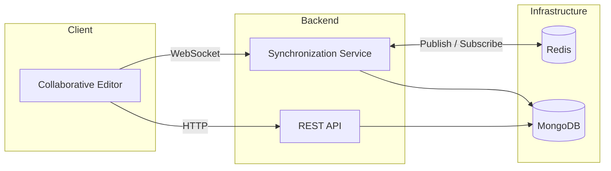
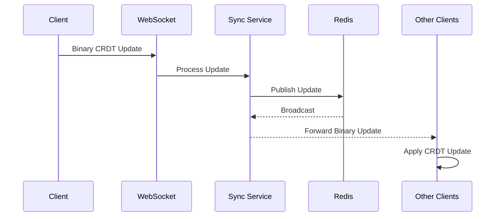
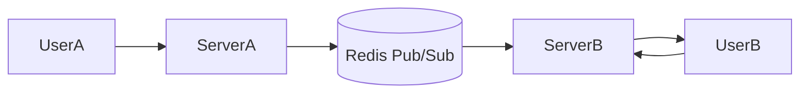

# Real-Time Collaborative Document Synchronization System

A distributed real-time document synchronization system built to explore network communication, concurrent state synchronization, and scalable backend architecture.

Although the user-facing application is a collaborative document editor, the primary focus of this project is the system responsible for synchronizing shared document state across multiple users connected through independent backend instances.

The implementation combines persistent TCP connections (WebSockets), Conflict-free Replicated Data Types (CRDTs), Redis Pub/Sub, and MongoDB to maintain a consistent document state while multiple users edit concurrently.

Instead of transmitting the complete document after every modification, only incremental binary updates are exchanged, reducing network overhead and improving synchronization latency.

---

# Engineering Problem

Traditional web applications operate using independent HTTP requests.

Collaborative applications introduce a different challenge:

- multiple users modify shared state simultaneously,
- updates must propagate with minimal delay,
- concurrent edits should not overwrite one another,
- all connected clients should eventually observe the same document state.

The objective of this project was to design a synchronization pipeline capable of handling these requirements while remaining modular and scalable.

---

# Key Concepts Explored

This project provided practical experience with several systems-oriented concepts.

### Networking

- Persistent TCP communication using WebSockets
- HTTP request-response architecture
- Binary message transmission
- Client-server communication

### Distributed Systems

- State synchronization
- Event propagation
- Redis Pub/Sub messaging
- Horizontal scalability

### Concurrency

- Concurrent document modifications
- Conflict-free synchronization using CRDTs
- Event ordering

### Backend Engineering

- Stateless authentication
- Modular service architecture
- Database persistence
- Event-driven communication

---

# High-Level System Architecture



The architecture separates user management from real-time synchronization.

REST endpoints manage infrequent operations such as authentication and document management.

Persistent WebSocket connections are reserved exclusively for low-latency document synchronization.

This separation keeps communication patterns simple while allowing each protocol to serve its intended purpose.

---

# Why This Architecture?

Rather than building a monolithic server, the application separates independent responsibilities.

| Component | Responsibility |
|-----------|----------------|
| REST API | Authentication and document management |
| Synchronization Service | Real-time document updates |
| Redis | Cross-instance message propagation |
| MongoDB | Persistent storage |
| Client | Rendering and local CRDT application |

This modular design simplifies maintenance and makes individual components easier to scale independently.

---

# Communication Architecture

The system uses two independent communication models, each selected based on the characteristics of the operation being performed.

## 1. HTTP (REST)

REST APIs are used for operations that occur infrequently and naturally follow a request-response pattern.

Examples include:

- User registration
- Authentication
- Creating documents
- Fetching document metadata
- Listing available documents

```text
Client
   │
HTTP Request
   │
Express Server
   │
MongoDB
   │
HTTP Response
```

Using HTTP for these operations keeps the interface stateless and simplifies client-server communication.

---

## 2. WebSocket Communication

Document editing requires continuous bidirectional communication.

Once a document is opened, the client establishes a persistent WebSocket connection with the synchronization service.

```text
Client
    ⇅
WebSocket Connection
    ⇅
Synchronization Service
```

Unlike HTTP polling, the server can immediately push updates whenever another collaborator modifies the document.

This significantly reduces synchronization latency and eliminates unnecessary network requests.

---

# Document Synchronization Pipeline

Every edit follows the same synchronization pipeline.



Only incremental document updates are exchanged.

The complete document is not retransmitted after every edit, reducing bandwidth usage while allowing multiple users to edit simultaneously.

---

# Distributed Synchronization

Supporting multiple backend instances introduces an additional synchronization challenge.

Users connected to different servers should observe identical document state.



Redis Pub/Sub acts as the communication layer between backend instances.

When one synchronization service receives a document update, it publishes the update to Redis.

Every backend instance subscribed to the same channel receives the update and forwards it to its locally connected clients.

This architecture removes direct dependencies between backend servers while allowing the system to scale horizontally.

---

# Component Responsibilities

| Component | Primary Responsibility |
|------------|------------------------|
| React Client | User interface and editor rendering |
| TipTap | Rich text editing |
| Yjs | Local CRDT state management |
| Express | Authentication and REST APIs |
| WebSocket Service | Low-latency synchronization |
| Redis | Cross-instance event propagation |
| MongoDB | Persistent document storage |

Each component performs a single well-defined task, reducing coupling between different parts of the system.

---

# Engineering Decisions

## Persistent Connections

Maintaining a persistent WebSocket connection avoids the overhead of repeatedly establishing HTTP connections during active editing sessions.

This allows document updates to be propagated immediately after they occur.

---

## Incremental Synchronization

Instead of transmitting the entire document after every modification, the system exchanges compact binary CRDT updates.

Benefits include:

- Lower network bandwidth
- Reduced serialization overhead
- Faster synchronization
- Better scalability for large documents

---

## Stateless Backend Services

Authentication is performed using JWTs rather than server-side sessions.

This allows backend instances to remain stateless, making horizontal scaling significantly simpler because session information does not need to be shared between servers.

---

## Event-Driven Communication

The synchronization service reacts to incoming events instead of continuously polling for state changes.

This event-driven model reduces unnecessary work while improving responsiveness during collaborative editing.

---

# Networking Concepts Demonstrated

This project applies several networking concepts commonly encountered in distributed applications.

### TCP-Based Persistent Connections

WebSockets establish long-lived TCP connections that remain active throughout a collaborative editing session.

---

### Full-Duplex Communication

Both client and server can transmit messages independently without waiting for a request-response cycle.

This enables real-time synchronization between collaborators.

---

### Binary Message Transmission

Yjs encodes document changes as compact binary updates before transmission.

Compared to repeatedly sending serialized document text, binary updates reduce payload size and improve synchronization efficiency.

---

### Publish-Subscribe Messaging

Redis Pub/Sub decouples backend instances by acting as an intermediary message broker.

Rather than communicating directly, backend services publish updates to Redis and subscribe to document update channels.

This simplifies horizontal scaling while keeping backend services independent.

---

# Implementation Challenges

Developing a real-time synchronization system introduced several engineering challenges beyond implementing REST APIs and a user interface.

The primary focus was maintaining a consistent shared document state while minimizing communication overhead.

---

## Challenge 1 – Editor Initialization Race Condition

**Problem**

The editor could initialize before the shared document state was fully synchronized, resulting in inconsistent initial content.

**Solution**

Initialization was delayed until the synchronization layer completed loading the shared document state.

---

## Challenge 2 – Cross-Instance Synchronization

**Problem**

When collaborators connected to different backend instances, document updates remained local to the server that initially received them.

**Solution**

Redis Pub/Sub was introduced as a messaging layer between backend instances.

Every synchronization service publishes outgoing updates and subscribes to updates generated by other instances, allowing all connected clients to observe the same document state.

---

## Challenge 3 – Efficient Network Communication

**Problem**

Sending the complete document after every edit increases bandwidth consumption and introduces unnecessary serialization overhead.

**Solution**

The synchronization layer exchanges only binary CRDT updates.

Each client reconstructs the latest document state locally by applying incremental updates instead of replacing the complete document.

---

## Challenge 4 – Stateless Authentication

**Problem**

Traditional session-based authentication complicates horizontal scaling because session state must be shared across backend instances.

**Solution**

JWT-based authentication allows backend services to remain stateless.

Any backend instance can authenticate incoming requests without relying on shared session storage.

---

# Performance Considerations

Several implementation decisions were made to reduce latency and unnecessary resource utilization.

| Design Decision | Engineering Benefit |
|-----------------|--------------------|
| Persistent WebSocket connections | Eliminates repeated TCP connection establishment |
| Binary CRDT updates | Reduces network payload size |
| Redis Pub/Sub | Efficient cross-instance synchronization |
| Stateless JWT authentication | Simplifies horizontal scaling |
| Event-driven synchronization | Avoids polling overhead |

The project prioritizes efficient communication rather than computational optimization.

---

# Design Trade-offs

Every architectural decision introduces both advantages and limitations.

| Decision | Benefit | Trade-off |
|----------|----------|-----------|
| WebSockets | Low-latency communication | Requires persistent connection management |
| CRDTs | Automatic conflict resolution | Higher implementation complexity |
| Redis Pub/Sub | Loose coupling between backend instances | Additional infrastructure dependency |
| JWT Authentication | Stateless architecture | Token revocation requires additional handling |
| MongoDB | Flexible document persistence | Strong consistency guarantees depend on application logic |

Understanding these trade-offs was an important part of the project design.

---

# Possible Future Improvements

The current implementation provides the core synchronization pipeline.

Potential improvements include:

### Networking

- Binary protocol compression
- Heartbeat and keep-alive monitoring
- Improved reconnect strategy
- Connection pooling

### Synchronization

- Incremental snapshot persistence
- Partial document synchronization
- Fine-grained update batching
- Improved conflict visualization

### Scalability

- Load balancing across synchronization services
- Kubernetes deployment
- Distributed caching
- Horizontal database scaling

### Observability

- Structured logging
- Synchronization latency metrics
- Distributed tracing
- Runtime monitoring with Prometheus and Grafana

---

# Running the Project

## Clone Repository

```bash
git clone https://github.com/Abhijayapal/collaborative-document-editor.git

cd collaborative-document-editor
```

---

## Install Dependencies

Frontend

```bash
cd frontend

npm install
```

Backend

```bash
cd backend

npm install
```

---

## Configure Environment Variables

Create a `.env` file inside the backend directory.

```env
PORT=5000

MONGO_URI=<your_connection_string>

JWT_SECRET=<your_secret>

REDIS_URL=redis://localhost:6379
```

---

## Start the Application

Backend

```bash
npm run dev
```

Frontend

```bash
npm run dev
```

Redis

```bash
redis-server
```

Alternatively, launch all services using Docker Compose.

```bash
docker-compose up
```

---

# Technologies Used

| Category | Technologies |
|-----------|--------------|
| Language | JavaScript |
| Frontend | React, TipTap |
| Backend | Node.js, Express |
| Communication | HTTP, WebSockets |
| Synchronization | Yjs (CRDT) |
| Messaging | Redis Pub/Sub |
| Database | MongoDB |
| Authentication | JWT, bcrypt |
| Containerization | Docker |

---

# References

The implementation was developed using concepts and documentation from:

- Yjs Documentation
- TipTap Documentation
- Redis Documentation
- Express.js Documentation
- MongoDB Documentation
- WebSocket RFC 6455

---
# Engineering Takeaways

Building this project reinforced several practical software engineering principles:

- Persistent connections are more suitable than repeated request-response communication for real-time systems.
- Separating synchronization logic from REST APIs results in a cleaner and more maintainable architecture.
- Horizontal scalability requires backend instances to communicate through a messaging layer rather than directly.
- Incremental state synchronization is significantly more efficient than repeatedly transmitting complete application state.
- Designing distributed systems often involves understanding communication patterns and trade-offs rather than writing complex algorithms.
